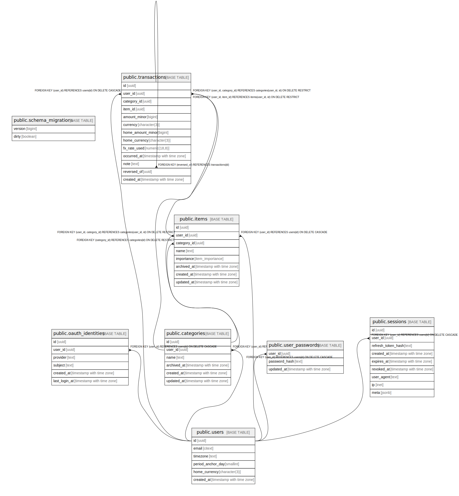

# moneycontrol

## Tables

| Name | Columns | Comment | Type |
| ---- | ------- | ------- | ---- |
| [public.schema_migrations](public.schema_migrations.md) | 2 |  | BASE TABLE |
| [public.users](public.users.md) | 6 |  | BASE TABLE |
| [public.oauth_identities](public.oauth_identities.md) | 6 |  | BASE TABLE |
| [public.categories](public.categories.md) | 6 |  | BASE TABLE |
| [public.items](public.items.md) | 8 |  | BASE TABLE |
| [public.transactions](public.transactions.md) | 13 |  | BASE TABLE |
| [public.user_passwords](public.user_passwords.md) | 3 |  | BASE TABLE |
| [public.sessions](public.sessions.md) | 9 |  | BASE TABLE |

## Stored procedures and functions

| Name | ReturnType | Arguments | Type |
| ---- | ------- | ------- | ---- |
| public.digest | bytea | text, text | FUNCTION |
| public.digest | bytea | bytea, text | FUNCTION |
| public.hmac | bytea | text, text, text | FUNCTION |
| public.hmac | bytea | bytea, bytea, text | FUNCTION |
| public.crypt | text | text, text | FUNCTION |
| public.gen_salt | text | text | FUNCTION |
| public.gen_salt | text | text, integer | FUNCTION |
| public.encrypt | bytea | bytea, bytea, text | FUNCTION |
| public.decrypt | bytea | bytea, bytea, text | FUNCTION |
| public.encrypt_iv | bytea | bytea, bytea, bytea, text | FUNCTION |
| public.decrypt_iv | bytea | bytea, bytea, bytea, text | FUNCTION |
| public.gen_random_bytes | bytea | integer | FUNCTION |
| public.gen_random_uuid | uuid |  | FUNCTION |
| public.pgp_sym_encrypt | bytea | text, text | FUNCTION |
| public.pgp_sym_encrypt_bytea | bytea | bytea, text | FUNCTION |
| public.pgp_sym_encrypt | bytea | text, text, text | FUNCTION |
| public.pgp_sym_encrypt_bytea | bytea | bytea, text, text | FUNCTION |
| public.pgp_sym_decrypt | text | bytea, text | FUNCTION |
| public.pgp_sym_decrypt_bytea | bytea | bytea, text | FUNCTION |
| public.pgp_sym_decrypt | text | bytea, text, text | FUNCTION |
| public.pgp_sym_decrypt_bytea | bytea | bytea, text, text | FUNCTION |
| public.pgp_pub_encrypt | bytea | text, bytea | FUNCTION |
| public.pgp_pub_encrypt_bytea | bytea | bytea, bytea | FUNCTION |
| public.pgp_pub_encrypt | bytea | text, bytea, text | FUNCTION |
| public.pgp_pub_encrypt_bytea | bytea | bytea, bytea, text | FUNCTION |
| public.pgp_pub_decrypt | text | bytea, bytea | FUNCTION |
| public.pgp_pub_decrypt_bytea | bytea | bytea, bytea | FUNCTION |
| public.pgp_pub_decrypt | text | bytea, bytea, text | FUNCTION |
| public.pgp_pub_decrypt_bytea | bytea | bytea, bytea, text | FUNCTION |
| public.pgp_pub_decrypt | text | bytea, bytea, text, text | FUNCTION |
| public.pgp_pub_decrypt_bytea | bytea | bytea, bytea, text, text | FUNCTION |
| public.pgp_key_id | text | bytea | FUNCTION |
| public.armor | text | bytea | FUNCTION |
| public.armor | text | bytea, text[], text[] | FUNCTION |
| public.dearmor | bytea | text | FUNCTION |
| public.pgp_armor_headers | record | text, OUT key text, OUT value text | FUNCTION |
| public.citextin | citext | cstring | FUNCTION |
| public.citextout | cstring | citext | FUNCTION |
| public.citextrecv | citext | internal | FUNCTION |
| public.citextsend | bytea | citext | FUNCTION |
| public.citext | citext | character | FUNCTION |
| public.citext | citext | boolean | FUNCTION |
| public.citext | citext | inet | FUNCTION |
| public.citext_eq | bool | citext, citext | FUNCTION |
| public.citext_ne | bool | citext, citext | FUNCTION |
| public.citext_lt | bool | citext, citext | FUNCTION |
| public.citext_le | bool | citext, citext | FUNCTION |
| public.citext_gt | bool | citext, citext | FUNCTION |
| public.citext_ge | bool | citext, citext | FUNCTION |
| public.citext_cmp | int4 | citext, citext | FUNCTION |
| public.citext_hash | int4 | citext | FUNCTION |
| public.citext_smaller | citext | citext, citext | FUNCTION |
| public.citext_larger | citext | citext, citext | FUNCTION |
| public.min | citext | citext | a |
| public.max | citext | citext | a |
| public.texticlike | bool | citext, citext | FUNCTION |
| public.texticnlike | bool | citext, citext | FUNCTION |
| public.texticregexeq | bool | citext, citext | FUNCTION |
| public.texticregexne | bool | citext, citext | FUNCTION |
| public.texticlike | bool | citext, text | FUNCTION |
| public.texticnlike | bool | citext, text | FUNCTION |
| public.texticregexeq | bool | citext, text | FUNCTION |
| public.texticregexne | bool | citext, text | FUNCTION |
| public.regexp_match | _text | citext, citext | FUNCTION |
| public.regexp_match | _text | citext, citext, text | FUNCTION |
| public.regexp_matches | _text | citext, citext | FUNCTION |
| public.regexp_matches | _text | citext, citext, text | FUNCTION |
| public.regexp_replace | text | citext, citext, text | FUNCTION |
| public.regexp_replace | text | citext, citext, text, text | FUNCTION |
| public.regexp_split_to_array | _text | citext, citext | FUNCTION |
| public.regexp_split_to_array | _text | citext, citext, text | FUNCTION |
| public.regexp_split_to_table | text | citext, citext | FUNCTION |
| public.regexp_split_to_table | text | citext, citext, text | FUNCTION |
| public.strpos | int4 | citext, citext | FUNCTION |
| public.replace | text | citext, citext, citext | FUNCTION |
| public.split_part | text | citext, citext, integer | FUNCTION |
| public.translate | text | citext, citext, text | FUNCTION |
| public.citext_pattern_lt | bool | citext, citext | FUNCTION |
| public.citext_pattern_le | bool | citext, citext | FUNCTION |
| public.citext_pattern_gt | bool | citext, citext | FUNCTION |
| public.citext_pattern_ge | bool | citext, citext | FUNCTION |
| public.citext_pattern_cmp | int4 | citext, citext | FUNCTION |
| public.citext_hash_extended | int8 | citext, bigint | FUNCTION |
| public.set_updated_at | trigger |  | FUNCTION |

## Enums

| Name | Values |
| ---- | ------- |
| public.item_importance | NIEPOTRZEBNY, NIEZBEDNY, WAZNY |

## Relations

---

> Generated by [tbls](https://github.com/k1LoW/tbls)
