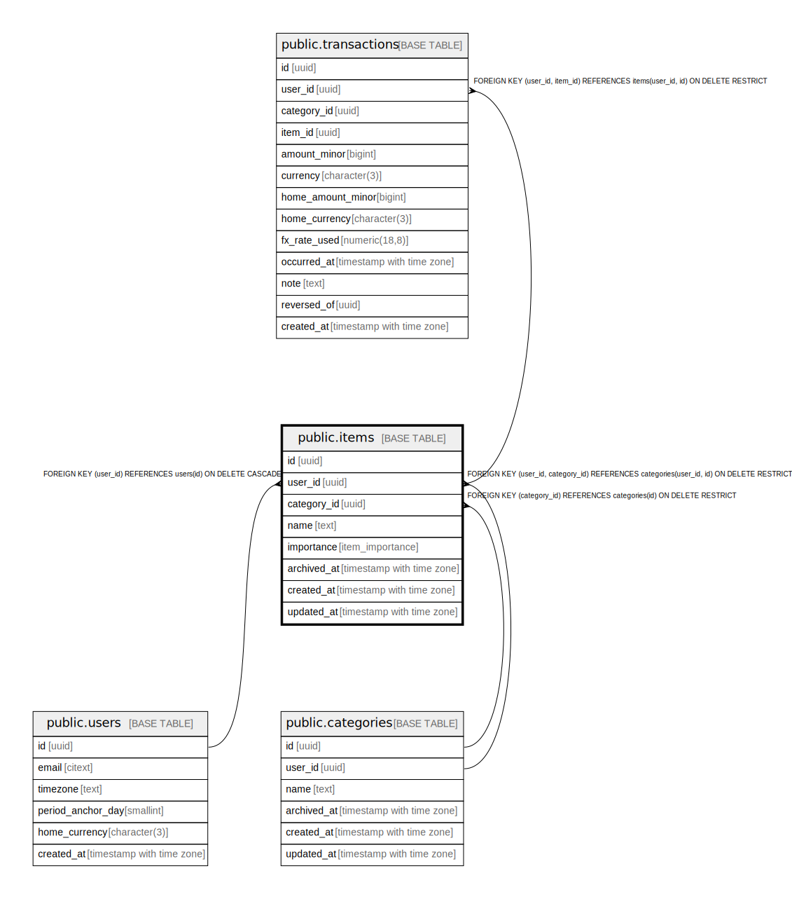

# public.items

## Description

## Columns

| Name | Type | Default | Nullable | Children | Parents | Comment |
| ---- | ---- | ------- | -------- | -------- | ------- | ------- |
| id | uuid | gen_random_uuid() | false | [public.transactions](public.transactions.md) |  |  |
| user_id | uuid |  | false | [public.transactions](public.transactions.md) | [public.users](public.users.md) [public.categories](public.categories.md) |  |
| category_id | uuid |  | false |  | [public.categories](public.categories.md) |  |
| name | text |  | false |  |  |  |
| importance | item_importance |  | false |  |  |  |
| archived_at | timestamp with time zone |  | true |  |  |  |
| created_at | timestamp with time zone | now() | false |  |  |  |
| updated_at | timestamp with time zone | now() | false |  |  |  |

## Constraints

| Name | Type | Definition |
| ---- | ---- | ---------- |
| items_user_id_fkey | FOREIGN KEY | FOREIGN KEY (user_id) REFERENCES users(id) ON DELETE CASCADE |
| items_category_id_fkey | FOREIGN KEY | FOREIGN KEY (category_id) REFERENCES categories(id) ON DELETE RESTRICT |
| items_category_belongs_to_user | FOREIGN KEY | FOREIGN KEY (user_id, category_id) REFERENCES categories(user_id, id) ON DELETE RESTRICT |
| items_pkey | PRIMARY KEY | PRIMARY KEY (id) |

## Indexes

| Name | Definition |
| ---- | ---------- |
| items_pkey | CREATE UNIQUE INDEX items_pkey ON public.items USING btree (id) |
| items_user_cat_name_unique | CREATE UNIQUE INDEX items_user_cat_name_unique ON public.items USING btree (user_id, category_id, lower(name)) |
| items_user_id_id_unique | CREATE UNIQUE INDEX items_user_id_id_unique ON public.items USING btree (user_id, id) |
| items_active_idx | CREATE INDEX items_active_idx ON public.items USING btree (user_id, category_id) WHERE (archived_at IS NULL) |

## Triggers

| Name | Definition |
| ---- | ---------- |
| items_set_updated_at | CREATE TRIGGER items_set_updated_at BEFORE UPDATE ON public.items FOR EACH ROW EXECUTE FUNCTION set_updated_at() |

## Relations

---

> Generated by [tbls](https://github.com/k1LoW/tbls)
