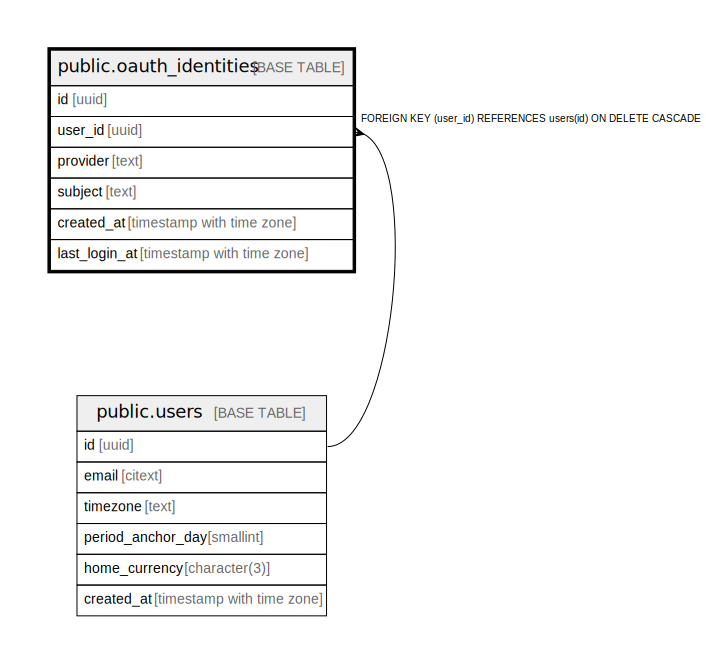

# public.oauth_identities

## Description

## Columns

| Name | Type | Default | Nullable | Children | Parents | Comment |
| ---- | ---- | ------- | -------- | -------- | ------- | ------- |
| id | uuid | gen_random_uuid() | false |  |  |  |
| user_id | uuid |  | false |  | [public.users](public.users.md) |  |
| provider | text |  | false |  |  |  |
| subject | text |  | false |  |  |  |
| created_at | timestamp with time zone | now() | false |  |  |  |
| last_login_at | timestamp with time zone |  | true |  |  |  |

## Constraints

| Name | Type | Definition |
| ---- | ---- | ---------- |
| oauth_identities_user_id_fkey | FOREIGN KEY | FOREIGN KEY (user_id) REFERENCES users(id) ON DELETE CASCADE |
| oauth_identities_pkey | PRIMARY KEY | PRIMARY KEY (id) |

## Indexes

| Name | Definition |
| ---- | ---------- |
| oauth_identities_pkey | CREATE UNIQUE INDEX oauth_identities_pkey ON public.oauth_identities USING btree (id) |
| oauth_identities_provider_subject_key | CREATE UNIQUE INDEX oauth_identities_provider_subject_key ON public.oauth_identities USING btree (provider, subject) |

## Relations

---

> Generated by [tbls](https://github.com/k1LoW/tbls)
