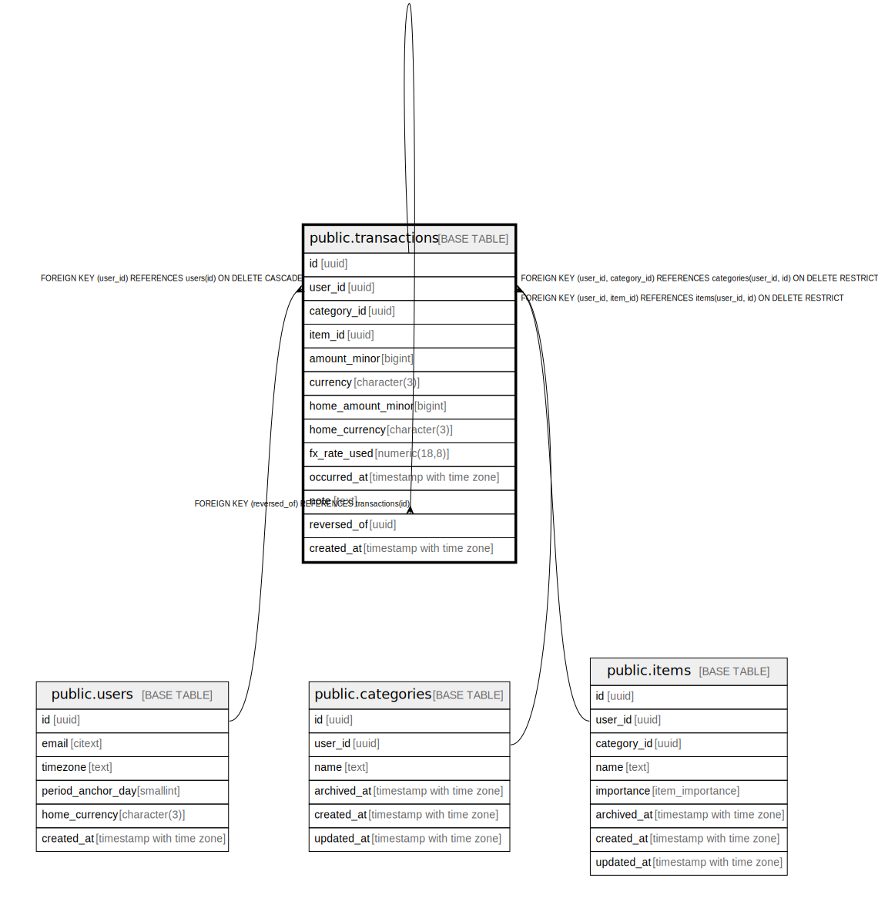

# public.transactions

## Description

## Columns

| Name | Type | Default | Nullable | Children | Parents | Comment |
| ---- | ---- | ------- | -------- | -------- | ------- | ------- |
| id | uuid | gen_random_uuid() | false | [public.transactions](public.transactions.md) |  |  |
| user_id | uuid |  | false |  | [public.users](public.users.md) [public.categories](public.categories.md) [public.items](public.items.md) |  |
| category_id | uuid |  | false |  | [public.categories](public.categories.md) |  |
| item_id | uuid |  | true |  | [public.items](public.items.md) |  |
| amount_minor | bigint |  | false |  |  |  |
| currency | character(3) |  | false |  |  |  |
| home_amount_minor | bigint |  | true |  |  |  |
| home_currency | character(3) |  | true |  |  |  |
| fx_rate_used | numeric(18,8) |  | true |  |  |  |
| occurred_at | timestamp with time zone |  | false |  |  |  |
| note | text |  | true |  |  |  |
| reversed_of | uuid |  | true |  | [public.transactions](public.transactions.md) |  |
| created_at | timestamp with time zone | now() | false |  |  |  |

## Constraints

| Name | Type | Definition |
| ---- | ---- | ---------- |
| transactions_amount_minor_check | CHECK | CHECK ((amount_minor <> 0)) |
| transactions_home_values_consistency | CHECK | CHECK ((((home_amount_minor IS NULL) AND (home_currency IS NULL) AND (fx_rate_used IS NULL)) OR ((home_amount_minor IS NOT NULL) AND (home_currency IS NOT NULL) AND (fx_rate_used IS NOT NULL)))) |
| transactions_user_id_fkey | FOREIGN KEY | FOREIGN KEY (user_id) REFERENCES users(id) ON DELETE CASCADE |
| transactions_category_fk | FOREIGN KEY | FOREIGN KEY (user_id, category_id) REFERENCES categories(user_id, id) ON DELETE RESTRICT |
| transactions_item_fk | FOREIGN KEY | FOREIGN KEY (user_id, item_id) REFERENCES items(user_id, id) ON DELETE RESTRICT |
| transactions_pkey | PRIMARY KEY | PRIMARY KEY (id) |
| transactions_reversed_of_fkey | FOREIGN KEY | FOREIGN KEY (reversed_of) REFERENCES transactions(id) |

## Indexes

| Name | Definition |
| ---- | ---------- |
| transactions_pkey | CREATE UNIQUE INDEX transactions_pkey ON public.transactions USING btree (id) |
| transactions_reversed_of_unique | CREATE UNIQUE INDEX transactions_reversed_of_unique ON public.transactions USING btree (reversed_of) WHERE (reversed_of IS NOT NULL) |
| transactions_user_occurred_idx | CREATE INDEX transactions_user_occurred_idx ON public.transactions USING btree (user_id, occurred_at) |
| transactions_user_category_occurred_idx | CREATE INDEX transactions_user_category_occurred_idx ON public.transactions USING btree (user_id, category_id, occurred_at) |
| transactions_user_item_occurred_idx | CREATE INDEX transactions_user_item_occurred_idx ON public.transactions USING btree (user_id, item_id, occurred_at) |

## Relations

---

> Generated by [tbls](https://github.com/k1LoW/tbls)
