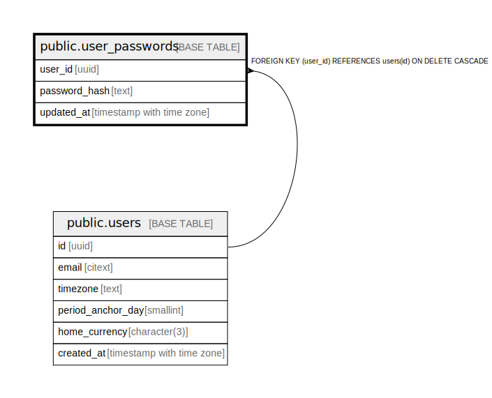

# public.user_passwords

## Description

## Columns

| Name | Type | Default | Nullable | Children | Parents | Comment |
| ---- | ---- | ------- | -------- | -------- | ------- | ------- |
| user_id | uuid |  | false |  | [public.users](public.users.md) |  |
| password_hash | text |  | false |  |  |  |
| updated_at | timestamp with time zone | now() | false |  |  |  |

## Constraints

| Name | Type | Definition |
| ---- | ---- | ---------- |
| user_passwords_user_id_fkey | FOREIGN KEY | FOREIGN KEY (user_id) REFERENCES users(id) ON DELETE CASCADE |
| user_passwords_pkey | PRIMARY KEY | PRIMARY KEY (user_id) |

## Indexes

| Name | Definition |
| ---- | ---------- |
| user_passwords_pkey | CREATE UNIQUE INDEX user_passwords_pkey ON public.user_passwords USING btree (user_id) |

## Relations

---

> Generated by [tbls](https://github.com/k1LoW/tbls)
