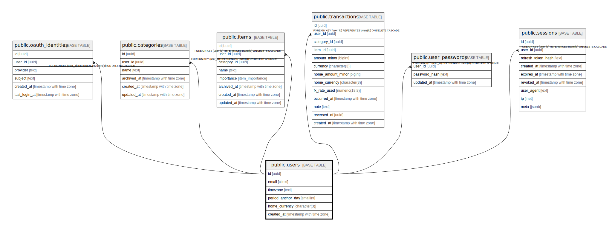

# public.users

## Description

## Columns

| Name | Type | Default | Nullable | Children | Parents | Comment |
| ---- | ---- | ------- | -------- | -------- | ------- | ------- |
| id | uuid | gen_random_uuid() | false | [public.oauth_identities](public.oauth_identities.md) [public.categories](public.categories.md) [public.items](public.items.md) [public.transactions](public.transactions.md) [public.user_passwords](public.user_passwords.md) [public.sessions](public.sessions.md) |  |  |
| email | citext |  | false |  |  |  |
| timezone | text |  | false |  |  |  |
| period_anchor_day | smallint |  | false |  |  |  |
| home_currency | character(3) | 'PLN'::bpchar | false |  |  |  |
| created_at | timestamp with time zone | now() | false |  |  |  |

## Constraints

| Name | Type | Definition |
| ---- | ---- | ---------- |
| users_period_anchor_day_check | CHECK | CHECK (((period_anchor_day >= 1) AND (period_anchor_day <= 31))) |
| users_pkey | PRIMARY KEY | PRIMARY KEY (id) |
| users_email_key | UNIQUE | UNIQUE (email) |

## Indexes

| Name | Definition |
| ---- | ---------- |
| users_pkey | CREATE UNIQUE INDEX users_pkey ON public.users USING btree (id) |
| users_email_key | CREATE UNIQUE INDEX users_email_key ON public.users USING btree (email) |

## Relations

---

> Generated by [tbls](https://github.com/k1LoW/tbls)
